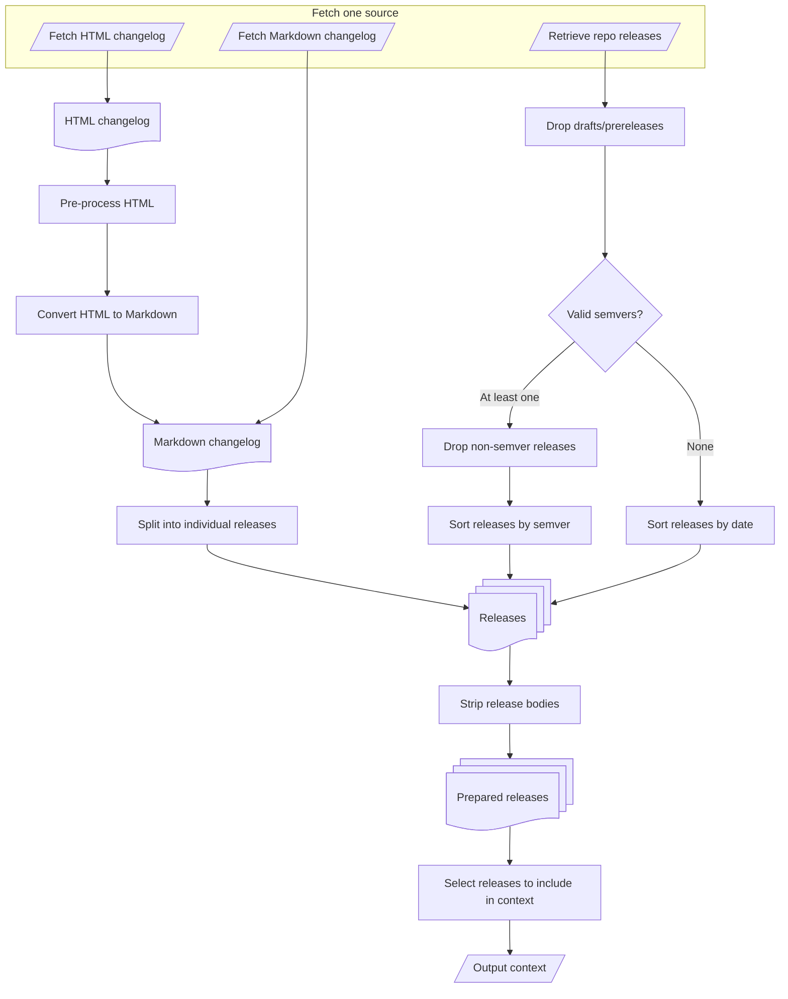

# `action-releases-context`

This action retrieves details of releases or changes (hereafter referred to as "releases" regardless of source) and prepares a suffix of the release lineage, biased towards recency, for use within an LLM's input context.

The releases can be obtained from one of:
1. URL (`html_url`) for a changelog in HTML format.
2. URL (`md_url`) for a changelog in Markdown format.
3. The GitHub REST API listing releases for a specified repository (`repository`).

After configurable pre-processing into and ordered list of individual releases, the preparation and selection of releases to include in the output JSON context is identical.

> [!CAUTION]
> This action is provided for my own use and published in case it is useful to others. If you rely on it, fork and maintain your own copy. No support or stability guarantees are offered.

## Prerequisites

Before using this workflow, ensure:
- The workflow has `contents: read` permission (either via the default `GITHUB_TOKEN` or a fine-grained token).

## Inputs

Various inputs are defined in the action to configure its operation:

| Name | Description | Default
| --- | --- | ---
| `repository` | The repository to check in the format `'owner/repo'` | `${{ github.repository }}`
| `html_url` | The URL for a changelog in HTML format | `''`
| `md_url` | The URL for a changelog in Markdown (or other structured plain text) format | `''`
| `min_releases` | The minimum number of releases to include | `1`
| `max_releases` | The maximum number of releases to include; 0 for no limit | `5`
| `max_age_days` | The maximum age in days (measured from the publication date) of release to include; 0 for no limit | `365`
| `max_tokens` | The maximum number of tokens to use (approximated by character count) | `500`
| `html_regexps` | Regular expressions and optional replacement text (one per line) applied to HTML before conversion to Markdown | `''`
| `md_release_regexp` | Regular expressions used to match per-release headings in Markdown changelists (or the results of converting HTML to Markdown) | *see below*
| `strip_images` | Remove any images (HTML or Markdown format) from the release bodies | `true`
| `strip_links` | Remove any links (HTML or Markdown format) from the release bodies | `true`
| `strip_html` | Remove all HTML tags from the release bodies | `false`
| `strip_regexps` | Regular expressions (one per line) applied to the release bodies for additional content that should be removed | `''`
| `github_token` | The GitHub token used to create an authenticated client | `${{ github.token }}`

## Operation

<details>
<summary>Action Flowchart</summary>



</details>

### Changelog URLs

If `html_url` is specified then it takes priority, and is used to retrieve a changelog in HTML format. Any `html_regexps` patterns (in JavaScript-style `/pattern/flags` or `/pattern/flags 'replacement'` format) are used to replace raw content prior to conversion to Markdown.

If `md_url` is specified (but not `html_url`) then it is used to retrieve a changelog in Markdown format.

Once a Markdown format changelog has been obtained, the `md_release_regexp` pattern is used to identify the individual releases. The pattern should match the release header line, with capture groups named `version` and `date` (but releases missing one or both are acceptable). If `md_release_regexp` is not specified then the first of the following patterns that has any matches is used:
- `/^#+ .*\b(?<version>v?\d+\.\d+\.\d+)\b.*\b(?<date>\d\d\d\d-\d\d?-\d\d?)\b.*$/gm;`
- `/^#+ .*\b(?<date>\d\d\d\d-\d\d?-\d\d?)\b.*\b(?<version>v?\d+\.\d+\.\d+)\b.*$/gm;`

If possible, dates are converted to ISO 8601 date-only format. Dates that cannot be parsed are preserved in their original form.

### Repository Releases

If `repository` is specified (without `html_url` or `md_url`), then releases are read via the GitHub REST API. Drafts and prerelease versions are excluded.

If at least one release has a tag name that can be parsed by [semver](https://www.npmjs.com/package/semver) as a semantic version then:
- All releases that cannot be parsed as semver are excluded. No warning is generated.
- The releases are sorted into descending order by semver (highest version number first).

Otherwise, the releases are sorted into reverse chronological order (most recent first) by publication date.

Publication dates are truncated to ISO 8601 date-only format.

### Releases Context

The release bodies are stripped using the selected `strip_*` options to optimise for semantic density over fidelity.

The `max_age_days` limit is then used to find the oldest acceptable release in that version-ordered list. All higher numbered versions above that point are included, which may include releases older than the age limit if the releases are not in chronological order (e.g. if sorted by semver but published out of order), ensuring that version history is not broken purely due to publication dates. Dates that cannot be parsed are treated as being 0 days old.

The `min_releases` constraint (if non-zero) takes priority over all of the max constraints (including `max_tokens`). This ensures that some releases are found, even if old or with large bodies. If the selected releases exceed `max_tokens` then their bodies are truncated as necessary.

## Outputs

The action provides the following outputs:

| Name | Description
| --- | ---
| `releases` | JSON array of releases prepared for LLM input context, in descending tag version order

## Usage

Example workflow to generate an AI summary of recent releases for Homebridge:

```yaml
name: Recent Releases
permissions:
  contents: read

on:
  workflow_dispatch:
  schedule:
    # Runs at 09:00 UTC daily
    # Stagger different repos to avoid hitting GitHub API rate limits
    - cron: '0 9 * * *'

jobs:
  recent-releases:
    runs-on: ubuntu-latest

    steps:
      - name: Retrieve Homebridge releases (REST API)
        id: homebridge
        uses: thoukydides/action-releases-context@v1
        with:
          repository: homebridge/homebridge
          strip_regexps: |
            /^\s*- `chore:.*\n/m

      - name: Retrieve Home Connect API changelog (HTML format)
        id: homeconnect
        uses: thoukydides/action-releases-context@v1
        with:
          html_url: https://developer.home-connect.com/changelog
          # Change <header> to <h1> for release headings prior to Markdown conversion
          # Remove page footer below </article> closing tag
          html_regexps: |
            /<(\/?)header>/i '<$1h1>'
            /<\/article>.*$/s
          md_release_regexp: |
            /^#\s+(?<date>\w+ \d\d?, \d\d\d\d)\s*$/m

      - name: Retrieve Matter.js changelog (Markdown format)
        id: matter-js
        uses: thoukydides/action-releases-context@v1
        with:
          md_url: https://raw.githubusercontent.com/matter-js/matter.js/refs/heads/main/CHANGELOG.md
          md_release_regexp: |
            /^#*\s*(?<version>v?\d+\.\d+\.\d+)\s+\((?<date>\d\d\d\d-\d\d?-\d\d?)\)\s*$/m
    
      - name: Generate an AI summary
        uses: actions/ai-inference@v1
        with:
          prompt: |
            Generate a Markdown summary of the releases listed below.
            For each release provide a 1-2 sentence description, highlighting user-visible changes.

            ### Homebridge:
            ${{ steps.homebridge.outputs.releases }}

            ### Home Connect API
            ${{ steps.homeconnect.outputs.releases }}

            ### Matter.js
            ${{ steps.matter-js.outputs.releases }}
```

> [!TIP]
> The `html_regexps` and `strip_regexps` are applied sequentially in the order provided, so an earlier pattern may affect whether a later one matches. The `g` flag is always added to all patterns.

## ISC License (ISC)

<details>
<summary>Copyright © 2026 Alexander Thoukydides</summary>

> Permission to use, copy, modify, and/or distribute this software for any purpose with or without fee is hereby granted, provided that the above copyright notice and this permission notice appear in all copies.
>
> THE SOFTWARE IS PROVIDED "AS IS" AND THE AUTHOR DISCLAIMS ALL WARRANTIES WITH REGARD TO THIS SOFTWARE INCLUDING ALL IMPLIED WARRANTIES OF MERCHANTABILITY AND FITNESS. IN NO EVENT SHALL THE AUTHOR BE LIABLE FOR ANY SPECIAL, DIRECT, INDIRECT, OR CONSEQUENTIAL DAMAGES OR ANY DAMAGES WHATSOEVER RESULTING FROM LOSS OF USE, DATA OR PROFITS, WHETHER IN AN ACTION OF CONTRACT, NEGLIGENCE OR OTHER TORTIOUS ACTION, ARISING OUT OF OR IN CONNECTION WITH THE USE OR PERFORMANCE OF THIS SOFTWARE.
</details>